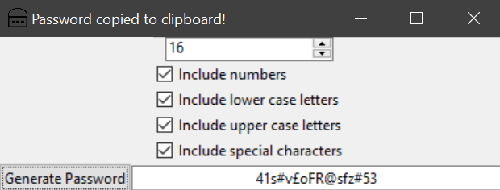

# PasswordGenerator-Python

A password generator written in Python.
The password automatically gets copied to clipboard on generation.

## How To Build

All you need is Python 3 and Tkinter.
You can use the makefile or just enter this into the terminal:

`python3 src/PasswordGenerator.py`

The makefile also provides the command for building the binary using pyinstaller.
